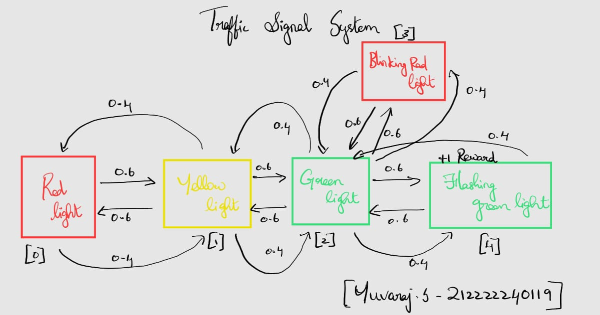
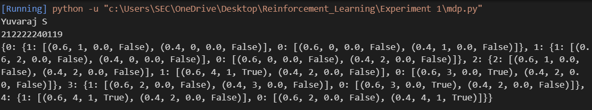

# MDP REPRESENTATION

## AIM:
The aim of this experiment is to create a Markov Decision Process (MDP) representation and implement it in Python to model the decision-making process in a traffic signal system.

## PROBLEM STATEMENT:

### Problem Description
The problem involves modeling a traffic signal system as a Markov Decision Process (MDP). The traffic signal transitions through different states (Red, Yellow, Green, Blinking Red, and Flashing Green) based on the actions taken by the system. The objective is to understand the transition probabilities and rewards associated with each state-action pair.

### State Space
The system consists of the following states:

0: Red Light (Stopped)

1: Yellow Light (Ready)

2: Green Light (Walking)

3: Blinking Red Light (Collapsed)

4: Flashing Green Light (Running - Goal)

### Action Space
Each state can have different actions that result in transitions:

0: Stay in the current state.

1: Move forward in the traffic light cycle.

2: Move left (return to a previous state if applicable).

### Sample Action
If in state 2 (Green Light), taking action 1 (Right) moves the system to state 4 (Flashing Green) with a probability of 0.6 and stays in 2 with a probability of 0.4.

### Reward Function
Transitioning to the goal state (Flashing Green) yields a reward of 1.

Other transitions provide a reward of 0.0.

If the system moves to the Blinking Red state (Failure), it might stay stuck with negative consequences.

### Graphical Representation





## PYTHON REPRESENTATION:
```
p = {
    0: {  # Red Light (Stopped)
        1: [(0.6, 1, 0.0, False), (0.4, 0, 0.0, False)],  # Proceed → Yellow Light
        0: [(0.6, 0, 0.0, False), (0.4, 1, 0.0, False)]   # Stay → Remain at Red
    },
    1: {  # Yellow Light (Ready)
        1: [(0.6, 2, 0.0, False), (0.4, 0, 0.0, False)],  # Proceed → Green Light
        0: [(0.6, 0, 0.0, False), (0.4, 2, 0.0, False)]   # Stay → Might go back or proceed
    },
    2: {  # Green Light (Walking)
        2: [(0.6, 1, 0.0, False), (0.4, 2, 0.0, False)],  # Left → Go back to Yellow Light
        1: [(0.6, 4, 1, True), (0.4, 2, 0.0, False)],  # Right → Reach Flashing Green (Success)
        0: [(0.6, 3, 0.0, True), (0.4, 2, 0.0, False)]  # Up → Blinking Red (Failure)
    },
    3: {  # Blinking Red Light (Collapsed)
        1: [(0.6, 2, 0.0, False), (0.4, 3, 0.0, False)],  # Try to recover → Green
        0: [(0.6, 3, 0.0, True), (0.4, 2, 0.0, False)]   # Stay stuck
    },
    4: {  # Flashing Green Light (Running - Goal)
        1: [(0.6, 4, 1, True), (0.4, 2, 0.0, False)],  # Stay at Flashing Green (Success)
        0: [(0.6, 2, 0.0, False), (0.4, 4, 1, True)]   # Move back to Green Light
    }
}
```

## OUTPUT:





## RESULT:
The Markov Decision Process (MDP) has been successfully represented using Python dictionaries. Each state-action pair contains information about possible transitions, transition probabilities, associated rewards, and whether the next state is terminal or not. This representation can be used for further analysis and decision-making algorithms such as reinforcement learning.

