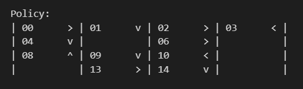
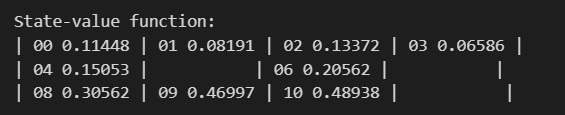
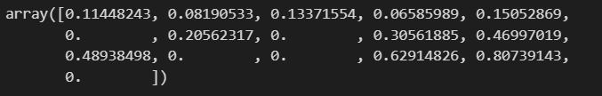
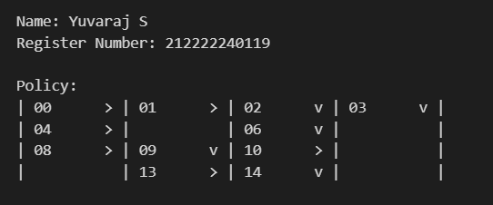
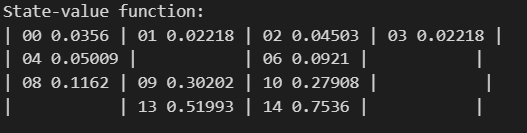
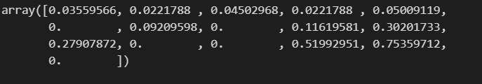
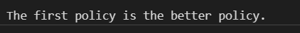

# POLICY EVALUATION

## AIM
To evaluate and compare different policies in the Frozen Lake environment and find the best policy for reaching the goal successfully.

## PROBLEM STATEMENT
In the Frozen Lake environment, an agent must navigate from the start to the goal while avoiding holes. Movements are uncertain due to slipperiness. A policy guides the agent’s actions, but not all policies are effective. The task is to:

Evaluate a given policy (V1) using policy evaluation.
Create and test a new policy (V2) to improve performance.
Compare both policies based on success rate and rewards.
Find the best policy for safely reaching the goal.
This helps in identifying the most efficient way to complete the task.

## POLICY EVALUATION FUNCTION
```python
def policy_evaluation(pi, P, gamma=1.0, theta=1e-10):
    prev_V = np.zeros(len(P), dtype=np.float64)
    # Write your code here to evaluate the given policy
    while True:
      V=np.zeros(len(P))
      for s in range(len(P)):
        for prob,next_state,reward,done in P[s][pi(s)]:
           V[s]+=prob*(reward+gamma *prev_V[next_state]*(not done))
      if np.max(np.abs(prev_V-V))<theta:
        break
      prev_V=V.copy()
    return V
```

## OUTPUT:
### Policy 1:











### Policy 2:














## RESULT:

Thus, The Python program to evaluate the given policy is successfully executed.
