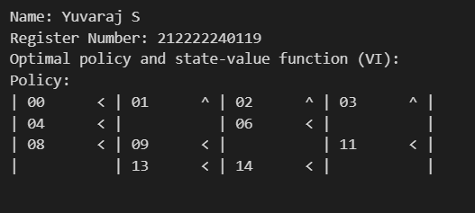

# VALUE ITERATION ALGORITHM

## AIM
To develop a Python program to find the optimal policy for the given MDP using the value iteration algorithm.

## PROBLEM STATEMENT
The FrozenLake environment in OpenAI Gym is a gridworld problem that challenges reinforcement learning agents to navigate a slippery terrain to reach a goal state while avoiding hazards. The environment is closed with a fence, so the agent cannot leave the gridworld. The agent must determine the best actions to take from each state to maximize its reward.

## VALUE ITERATION ALGORITHM
1. Initialize the value function for all states to zero.
2. Iterate until the values converge, meaning changes become very small.
3. For each state, evaluate all possible actions.
4. Estimate expected rewards by considering next states and their probabilities.
5. Update the value function by selecting the best action that maximizes future rewards.
6. Repeat the process until the value function stops changing significantly.
7. Extract the optimal policy by choosing the action that leads to the highest value for each state.
8. Ensure the agent follows the best possible path to maximize rewards.
9. Used in Markov Decision Processes (MDPs) where the environment is uncertain or stochastic.
10. Guarantees finding the optimal policy, making it useful in reinforcement learning applications.

## VALUE ITERATION FUNCTION
#### Name: Thiyagarajan A
#### Register Number: 212222240110
```
envdesc = [
    "SFFF",
    "FHFH",
    "FFHF",
    "GFFH"
]
env = gym.make('FrozenLake-v1',desc=envdesc)
init_state = env.reset()
goal_state = 12 #Enter the Goal state
P = env.env.P
```
```
def value_iteration(P, gamma=1.0, theta=1e-10):
    V = np.zeros(len(P), dtype=np.float64)
    while True:
        Q = np.zeros((len(P), len(P[0])), dtype=np.float64)
        for s in range(len(P)):
            for a in range(len(P[s])):
                for prob, next_state, reward, done in P[s][a]:
                    Q[s][a] += prob * (reward+gamma*V[next_state]*(not done))
        if np.max(np.abs(V-np.max(Q, axis=1))) < theta:
            break
        V = np.max(Q, axis=1)
    pi= lambda s: {s:a for s, a in enumerate(np.argmax(Q, axis=1))}[s]

    return V, pi
```

## OUTPUT:
### optimal policy



### optimal value function


### success rate for the optimal policy


## RESULT:

Thus, a Python program is developed to find the optimal policy for the given MDP using the value iteration algorithm.
